# Azure Landing Zone Terraform Implementation ☁️🏗️

**Production-ready Azure Landing Zone (ALZ)** implementation using **Terraform** that provides flexible networking architectures, essential security policies, and follows Microsoft's Cloud Adoption Framework best practices.

## 🎯 **What This Implementation Provides**

This Terraform implementation delivers a **practical and balanced approach** to Azure Landing Zones:

- 🏗️ **Complete ALZ Management Group Hierarchy** - Full Microsoft-recommended structure
- 🌐 **Flexible Network Architecture** - Choose Hub & Spoke, Virtual WAN, or no networking
- 🛡️ **Essential Security Policies** - Core security controls without overwhelming complexity
- 📊 **Centralized Monitoring** - Log Analytics workspaces and automation accounts
- 💰 **Cost-Conscious Design** - Optional resource deployment to control expenses
- 🔧 **Production-Ready** - Supports both audit and enforce policy modes

## 📊 **Architecture Overview**

```mermaid
graph TB
    subgraph "Azure Tenant"
        TenantRoot["🏢 Tenant Root Group"]
        
        subgraph "ALZ Management Groups"
            ALZRoot["📁 [Org] ALZ Root<br/>Governance & Policies"]
            
            subgraph "Platform Services"
                Platform["🔧 Platform"]
                Connectivity["🌐 Connectivity<br/>Hub VNet or vWAN"]
                Identity["👤 Identity<br/>Azure AD Services"]
                Management["⚙️ Management<br/>Log Analytics & Automation"]
            end
            
            subgraph "Workload Landing Zones"
                LandingZones["🚀 Landing Zones"]
                Production["🏭 Production<br/>Prod Workloads"]
                NonProduction["🧪 Non-Production<br/>Dev/Test Workloads"]
            end
            
            Sandboxes["🏖️ Sandboxes<br/>Learning & Innovation"]
            Decommissioned["📦 Decommissioned<br/>Legacy Resources"]
        end
        
        subgraph "Optional Infrastructure" 
            subgraph "Hub & Spoke Network"
                HubVNet["🏢 Hub Virtual Network<br/>10.0.0.0/22"]
                SharedSvcs["📡 Shared Services<br/>10.0.0.0/24"]
                MgmtSvcs["⚙️ Management<br/>10.0.1.0/24"]
                BastionSub["🛡️ Bastion Subnet<br/>10.0.2.0/26"]
                FwSub["🔥 Firewall Subnet<br/>10.0.3.0/26"]
            end
            
            subgraph "Virtual WAN Alternative"
                vWAN["🌐 Virtual WAN"]
                vHub["🔗 Virtual Hub<br/>10.0.0.0/24"]
                ERGateway["🔌 ExpressRoute Gateway"]
                VPNGateway["🔐 VPN Gateway"]
            end
            
            subgraph "Management Resources"
                LogAnalytics["📈 Log Analytics Workspaces<br/>Production & Non-Production"]
                AutomationAcct["🤖 Azure Automation Account"]
                DataCollection["📊 Data Collection Rules"]
            end
        end
    end

    %% Relationships
    TenantRoot --> ALZRoot
    ALZRoot --> Platform
    ALZRoot --> LandingZones
    ALZRoot --> Sandboxes
    ALZRoot --> Decommissioned
    
    Platform --> Connectivity
    Platform --> Identity  
    Platform --> Management
    
    LandingZones --> Production
    LandingZones --> NonProduction
    
    %% Optional Infrastructure Connections
    Connectivity -.-> HubVNet
    Connectivity -.-> vWAN
    HubVNet --> SharedSvcs
    HubVNet --> MgmtSvcs
    HubVNet --> BastionSub
    HubVNet --> FwSub
    vWAN --> vHub
    vHub -.-> ERGateway
    vHub -.-> VPNGateway
    Management -.-> LogAnalytics
    Management -.-> AutomationAcct
    Management -.-> DataCollection

    %% Styling
    classDef mgmtGroup fill:#e1f5fe,stroke:#01579b,stroke-width:2px
    classDef platform fill:#f3e5f5,stroke:#4a148c,stroke-width:2px
    classDef workload fill:#e8f5e8,stroke:#1b5e20,stroke-width:2px
    classDef network fill:#fff3e0,stroke:#e65100,stroke-width:2px
    classDef optional fill:#f5f5f5,stroke:#616161,stroke-width:1px,stroke-dasharray: 5 5
    
    class ALZRoot,TenantRoot mgmtGroup
    class Platform,Connectivity,Identity,Management platform
    class LandingZones,Production,NonProduction,Sandboxes,Decommissioned workload
    class HubVNet,vWAN,SharedSvcs,MgmtSvcs,BastionSub,FwSub,vHub network
    class LogAnalytics,AutomationAcct,DataCollection,ERGateway,VPNGateway optional
```



## 🏗️ **What Gets Deployed**

### **Core Components (Always Deployed)**
1. **Management Group Hierarchy** - Complete ALZ structure with 9 management groups
2. **Subscription Assignments** - Optional assignment of subscriptions to management groups

### **Optional Components (Configurable)**
3. **Connectivity Infrastructure** - Hub & Spoke VNet OR Virtual WAN architecture
4. **Security Policies** - 8 essential security policies (audit or enforce mode)
5. **Management Resources** - Log Analytics workspaces and Azure Automation
6. **Monitoring Setup** - Data collection rules and centralized logging

## 🛡️ **Security Policies Deployed**

When `deploy_core_policies = true`, the following **essential security controls** are applied:

| Policy | Purpose | Target Scope | Enforcement |
|--------|---------|-------------|-------------|
| **Secure Storage Transfer** | Require HTTPS for storage accounts | All Resources | Configurable |
| **SQL Encryption** | Require Transparent Data Encryption | All Resources | Configurable |
| **VM Backup Protection** | Require Azure Backup for VMs | Landing Zones | Configurable |
| **Location Restrictions** | Limit resource deployment regions | All Resources | Configurable |
| **Resource Tagging** | Require Environment tags | All Resources | Configurable |
| **Network Security** | Block RDP/SSH from Internet | Landing Zones | Configurable |
| **Key Vault Protection** | Require purge protection | All Resources | Configurable |
| **Activity Log Retention** | Ensure logging compliance | All Resources | Configurable |

**Policy Modes:**
- `DoNotEnforce` (Audit Mode) - Report violations without blocking
- `Default` (Enforce Mode) - Block non-compliant resource deployment

## 🌐 **Network Architecture Options**

### **Option 1: Hub & Spoke (Default)**
```
Hub VNet (10.0.0.0/22)
├── Shared Services (10.0.0.0/24)
├── Management (10.0.1.0/24)  
├── Azure Bastion (10.0.2.0/26)
└── Azure Firewall (10.0.3.0/26)

Connected Spoke VNets:
├── Production Workloads
├── Development Workloads
└── Management Workloads
```

### **Option 2: Virtual WAN**
```
Virtual WAN
└── Virtual Hub (10.0.0.0/24)
    ├── ExpressRoute Gateway (Optional)
    ├── VPN Gateway (Optional)
    └── Azure Firewall (Optional)

Connected VNets:
├── Production Workloads
├── Development Workloads
└── Management Workloads
```

### **Option 3: No Networking**
- Management groups and policies only
- Ideal for initial governance deployment
- Networking can be added later

## 🚀 **Quick Start**

### **1. Prerequisites**

**Azure Environment:**
```bash
# Azure CLI login with appropriate permissions
az login
az account set --subscription "<management-subscription-id>"

# Terraform >= 1.5.0
terraform version
```

**Terraform Backend Storage Account:**
You'll need an Azure Storage Account for Terraform state management. You can either:

**Option A: Use existing storage account**
- Ensure you have a storage account with a blob container
- Note the resource group name, storage account name, and container name

**Option B: Create new storage account**
```bash
# Create resource group for Terraform state
az group create --name "rg-terraform-state-prod" --location "westus3"

# Create storage account
az storage account create \
  --name "stterraformstateprod001" \
  --resource-group "rg-terraform-state-prod" \
  --location "westus3" \
  --sku "Standard_LRS" \
  --encryption-services blob

# Create container
az storage container create \
  --name "tfstate" \
  --account-name "stterraformstateprod001"
```

### **2. Backend Configuration**
This implementation uses Azure Storage as the Terraform backend for state management. You need to set up the backend configuration before deployment.

**Option 1: Using Backend Config File (Recommended)**
```bash
# Copy the example configuration
cp backend.conf.example backend.conf

# Edit backend.conf with your values
# Required values:
# - resource_group_name: Resource group containing the storage account
# - storage_account_name: Name of your Terraform state storage account  
# - container_name: Container name (e.g., "tfstate")
# - key: State file key (e.g., "alz/terraform.tfstate")
# - subscription_id: Azure subscription ID
# - tenant_id: Azure tenant ID
```

**Option 2: Using CLI Parameters**
```bash
# Initialize with CLI parameters
terraform init \
  -backend-config="resource_group_name=rg-terraform-state-prod" \
  -backend-config="storage_account_name=stterraformstateprod001" \
  -backend-config="container_name=tfstate" \
  -backend-config="key=alz/terraform.tfstate" \
  -backend-config="use_azuread_auth=true" \
  -backend-config="subscription_id=xxxxxxxx-xxxx-xxxx-xxxx-xxxxxxxxxxxx" \
  -backend-config="tenant_id=xxxxxxxx-xxxx-xxxx-xxxx-xxxxxxxxxxxx"
```

**Backend Authentication Methods:**
- **Azure AD Auth** (Recommended): `use_azuread_auth = true`
- **Access Key**: `access_key = "your-storage-account-access-key"`
- **SAS Token**: `sas_token = "your-sas-token"`

### **3. Configuration**
Edit `terraform.tfvars` for your environment:
```hcl
# Core Settings
root_management_group_name = "Contoso ALZ"
resource_prefix           = "contoso"
org_name                 = "contoso" 
location                 = "westus3"

# Network Architecture Choice
network_architecture = "hub_spoke"  # or "vwan" or "none"
deploy_connectivity_resources = true

# Security Policies
deploy_core_policies    = true
policy_enforcement_mode = "DoNotEnforce"  # Start in audit mode

# Optional Resources
deploy_log_analytics_workspace = true
deploy_automation_account      = true
```

### **4. Validate & Deploy**
```bash
# Optional: Run comprehensive validation script
./validate-alz.sh

# Initialize Terraform with backend configuration
terraform init -backend-config=backend.conf

# Review deployment plan
terraform plan

# Deploy infrastructure
terraform apply
```

**📋 Validation Script (Optional but Recommended)**

The included `validate-alz.sh` script performs comprehensive pre-deployment checks:
- ✅ Azure CLI and Terraform installation & versions
- ✅ Azure authentication and permissions
- ✅ Terraform configuration validation
- ✅ Required variables and configuration recommendations
- ✅ Dry-run terraform plan execution

Run `./validate-alz.sh` before deployment to catch common issues early.

## 🗃️ **State Management**

This implementation uses **Azure Storage** for Terraform state management with the following benefits:

- **🔒 Secure State Storage** - State files stored in Azure Storage with encryption
- **👥 Team Collaboration** - Shared state access for multiple team members
- **🔐 Access Control** - Azure RBAC and Azure AD authentication
- **📋 State Locking** - Automatic state locking to prevent concurrent modifications
- **🔄 Versioning** - State file versioning and backup capabilities

### **Backend File Structure**
```
backend.conf                 # Your backend configuration (gitignored)
backend.conf.example         # Template file with examples
versions.tf                  # Terraform and provider version constraints
```

The `backend.conf` file is automatically excluded from git commits to protect sensitive information.

## 📁 **Module Structure**

```
azure-terraform-alz/
├── main.tf                    # Root orchestration
├── versions.tf                # Terraform & provider versions + backend config
├── variables.tf               # Input variables  
├── locals.tf                  # Computed values
├── outputs.tf                 # Output values
├── terraform.tfvars           # Configuration
├── backend.conf.example       # Backend configuration template
├── validate-alz.sh            # Pre-deployment validation script
├── .gitignore                 # Excludes sensitive files and state
└── modules/
    ├── management_groups/     # ALZ management group hierarchy
    │   ├── main.tf           # Management group resources
    │   ├── variables.tf      # Module variables
    │   └── outputs.tf        # Management group IDs
    ├── connectivity/          # Network infrastructure
    │   ├── main.tf           # Hub & Spoke or Virtual WAN
    │   ├── variables.tf      # Network configuration
    │   └── outputs.tf        # Network resource outputs
    ├── core_policies/         # Essential security policies
    │   ├── main.tf           # Policy definitions & assignments
    │   ├── variables.tf      # Policy configuration
    │   └── outputs.tf        # Policy assignment IDs
    └── optional_resources/    # Management resources
        ├── main.tf           # Log Analytics, Automation
        ├── variables.tf      # Optional resource flags
        └── outputs.tf        # Resource outputs
```

## ⚙️ **Configuration Options**

### **Network Architecture Selection**
```hcl
network_architecture = "hub_spoke"  # Traditional hub and spoke
network_architecture = "vwan"       # Virtual WAN for complex connectivity  
network_architecture = "none"       # Management groups and policies only
```

### **Subscription Assignments**
```hcl
# Assign subscriptions to management groups (optional)
connectivity_subscription_id = "00000000-0000-0000-0000-000000000000"
identity_subscription_id     = "11111111-1111-1111-1111-111111111111" 
management_subscription_id   = "22222222-2222-2222-2222-222222222222"
```

### **Hub & Spoke Network Settings**
```hcl
hub_vnet_address_space = ["10.0.0.0/22"]

hub_subnets = {
  "snet-shared-services" = { address_prefixes = ["10.0.0.0/24"] }
  "snet-management"      = { address_prefixes = ["10.0.1.0/24"] }
  "AzureBastionSubnet"   = { address_prefixes = ["10.0.2.0/26"] }
  "AzureFirewallSubnet"  = { address_prefixes = ["10.0.3.0/26"] }
}
```

### **Virtual WAN Settings**
```hcl
virtual_hub_address_prefix   = "10.0.0.0/24"
deploy_express_route_gateway = false
deploy_vpn_gateway          = false
```

## 🎯 **Deployment Strategies**

### **Strategy 1: Phased Approach (Recommended)**
```bash
# Phase 0: Setup Backend Configuration
cp backend.conf.example backend.conf
# Edit backend.conf with your storage account details

# Phase 0.5: Validate Configuration (Recommended)
./validate-alz.sh

# Phase 1: Management Groups + Audit Policies
terraform init -backend-config=backend.conf
terraform apply \
  -var="deploy_connectivity_resources=false" \
  -var="policy_enforcement_mode=DoNotEnforce"

# Phase 2: Add Networking
terraform apply \
  -var="deploy_connectivity_resources=true"

# Phase 3: Enable Policy Enforcement (Optional)
terraform apply \
  -var="policy_enforcement_mode=Default"
```

### **Strategy 2: All-at-Once**
```bash
# Setup backend and deploy everything with audit-mode policies
./validate-alz.sh  # Optional validation
terraform init -backend-config=backend.conf
terraform apply
```

## 📊 **Resource Outputs**

After deployment, you'll have access to:

- **Management Group IDs** - For workload subscription assignments
- **Network Resource IDs** - Hub VNet or Virtual WAN for spoke connections
- **Policy Assignment IDs** - For compliance monitoring
- **Log Analytics Workspace IDs** - For workload monitoring integration

## 🔍 **Monitoring & Compliance**

### **Policy Compliance**
- View compliance in Azure Policy blade
- Review violations before enabling enforce mode
- Export compliance reports for auditing

### **Centralized Logging**
- Production Log Analytics Workspace
- Non-Production Log Analytics Workspace  
- Azure Automation Account for runbook management

### **Cost Management**
- Resource tagging for cost allocation
- Optional resource deployment to control expenses
- Proper resource naming for cost center identification

## ❓ **FAQ**

### **Q: How do I set up the Terraform backend storage account?**
**A:** You need an Azure Storage Account before deployment:
1. Create a storage account and container (see Prerequisites section)
2. Copy `backend.conf.example` to `backend.conf`
3. Update `backend.conf` with your storage account details
4. Run `terraform init -backend-config=backend.conf`

**The `backend.conf` file is gitignored to protect sensitive information.**

### **Q: Can I migrate from local state to Azure backend?**
**A:** Yes! Use the `terraform init -migrate-state` command after configuring your backend:
```bash
# Add backend configuration to versions.tf (already done)
# Create backend.conf file with your storage details
terraform init -backend-config=backend.conf -migrate-state
```

### **Q: What permissions do I need for the backend storage account?**
**A:** For Azure AD authentication (recommended), you need:
- `Storage Blob Data Contributor` role on the storage account
- `Reader` role on the resource group containing the storage account
- Or use storage account access keys (less secure but simpler)

### **Q: What's the difference between this and the ALZ Accelerator?**
**A:** This implementation focuses on **essential ALZ components** with **simplified complexity**:
- **ALZ Accelerator**: 100+ policies, complex CI/CD setup, enterprise-scale complexity
- **This Implementation**: 8 essential policies, direct Terraform deployment, practical simplicity

### **Q: Can I add more policies later?**
**A:** Yes! The `core_policies` module is designed to be easily extended. You can add additional Azure Policy definitions and assignments as needed.

### **Q: Which network architecture should I choose?**
**A:**
- **Hub & Spoke**: Best for most scenarios, traditional networking teams, single-region deployments
- **Virtual WAN**: Best for multi-region, complex connectivity scenarios, SD-WAN integration
- **None**: Best for initial governance deployment, add networking later

### **Q: How do I add workload subscriptions?**
**A:** After deployment:
1. Create or identify workload subscriptions
2. Assign them to appropriate management groups (Production/Non-Production)
3. Deploy spoke VNets that peer to the hub infrastructure
4. Apply workload-specific policies and configurations

### **Q: Is this production-ready?**
**A:** Yes, but follow best practices:
- Start with audit mode policies (`DoNotEnforce`)
- Test connectivity before deploying workloads
- Gradually enable policy enforcement
- Monitor compliance before moving to production

## 📚 **Additional Resources**

- [Azure Landing Zones Documentation](https://docs.microsoft.com/azure/cloud-adoption-framework/ready/landing-zone/)
- [Azure Policy Documentation](https://docs.microsoft.com/azure/governance/policy/)
- [Hub-Spoke Network Architecture](https://docs.microsoft.com/azure/architecture/reference-architectures/hybrid-networking/hub-spoke)
- [Virtual WAN Documentation](https://docs.microsoft.com/azure/virtual-wan/)
- [Azure Management Groups](https://docs.microsoft.com/azure/governance/management-groups/)

---

## 🤝 **Contributing**

This implementation prioritizes:
- **Clarity** - Easy to understand and modify
- **Practicality** - Real-world production use
- **Flexibility** - Adaptable to different organizational needs
- **Maintainability** - Simple ongoing management

Feel free to fork and customize for your specific requirements!

## 📞 **Support**

- Create an [issue](https://github.com/travishankins/azure-terraform-alz/issues) for bug reports and feature requests
- Check [Azure Landing Zones documentation](https://docs.microsoft.com/azure/cloud-adoption-framework/ready/landing-zone/) for architectural guidance
- Review [ALZ Accelerator](https://azure.github.io/Azure-Landing-Zones/accelerator/) for enterprise-scale patterns
- Explore [Azure Policy samples](https://docs.microsoft.com/azure/governance/policy/samples/) for additional governance policies
- Visit [Terraform Azure Provider](https://registry.terraform.io/providers/hashicorp/azurerm/latest/docs) for resource documentation

---

**Built with ❤️ following Azure Landing Zone best practices**