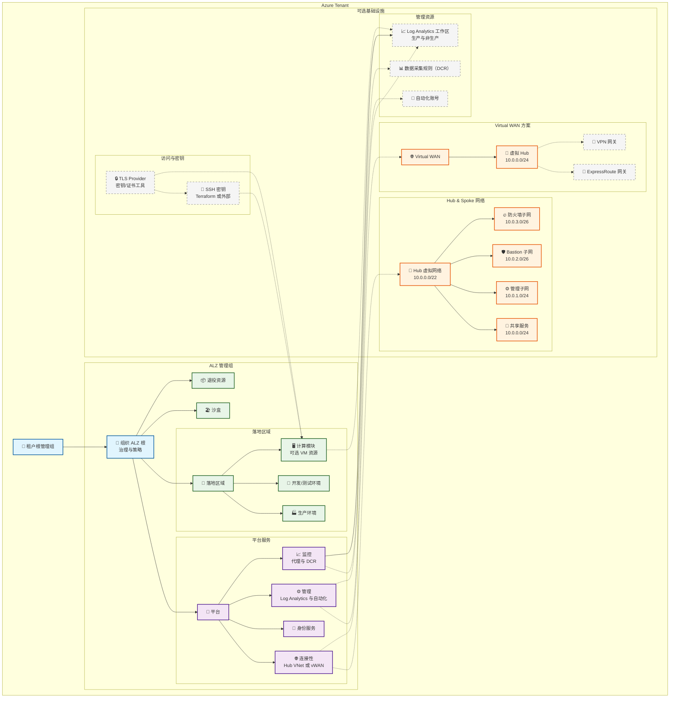

# Azure Landing Zone（ALZ）Terraform 实现（中文）

本项目是基于 Terraform 的生产级 Azure Landing Zone（ALZ）实现，提供灵活的网络架构、核心安全策略，并遵循微软云采用框架（CAF）的最佳实践。

> 英文版请参见 [README.md](README.md)。

## 提供的能力
- 管理组层级：完整的 ALZ 管理组结构
- 网络架构选型：Hub & Spoke、Virtual WAN 或无网络
- 安全策略：8 条核心策略，支持审计或强制模式
- 集中式监控：Log Analytics 与数据采集规则
- 成本可控：可选资源按需部署
- 生产就绪：配置简单、可扩展、易维护

## 新增功能
- 计算模块（可选）：
  - 通过 `deploy_compute_resources` 启用
  - 支持 `vm_os_type`、`vm_size` 和公网 IP 配置
- SSH 密钥生成模式：
  - `generate_ssh_key = true` 时由 Terraform 生成密钥
  - 支持外部/本地公钥；提供校验与安全建议（注意私钥在状态文件中的保护）
- Azure Monitor 集成：
  - 启用监控代理与数据采集规则
  - 生产/非生产 Log Analytics 工作区
  - 详见 [AZURE_MONITOR_GUIDE.md](AZURE_MONITOR_GUIDE.md)
- TLS Provider 支持：用于安全密钥与证书相关场景
- 校验工具增强：
  - `validate-alz.sh`：环境与配置基础校验
  - `validate-alz-features.sh`：功能完整性校验（Compute/SSH/Monitor 等）
  - 文档：`VALIDATION_SCRIPT_ASSESSMENT.md`、`VALIDATION_SCRIPTS_GUIDE.md`

## 部署内容概览
- 核心：管理组层级、（可选）订阅分配
- 可选：连接性（Hub & Spoke 或 Virtual WAN）、安全策略、管理资源、监控与日志、计算模块（可选）

## 架构总览（中文）



### TLS Provider 位置与作用

- 位置：位于架构的“访问与密钥”分组，与 `SSHKeys` 并列。
- 作用：提供安全的密钥/证书工具能力，用于可选的计算模块与 SSH 密钥工作流。
- 交互关系：
  - 协助 `SSHKeys` 在生成或处理密钥材料时的工具支持
  - 支持 `Compute` 模块在需要 TLS 密钥/证书操作的场景
```

## 快速开始
### 1. 先决条件
- Azure CLI 登录并选择管理订阅
- Terraform >= 1.5.0

### 2. 后端配置（Azure Storage 作为 Terraform Backend）
- 推荐使用 `backend.conf` 文件进行配置，或通过 CLI 参数传入
- 支持 Azure AD 认证、Access Key 或 SAS Token

### 3. 环境配置（编辑 `terraform.tfvars`）
- 设置管理组名称、前缀、组织名、位置
- 选择网络架构（`hub_spoke`、`vwan`、`none`）与是否部署连接性
- 设置安全策略模式（`DoNotEnforce` 或 `Default`）与可选资源

### 4. 校验与部署
```bash
./validate-alz.sh              # 基础环境与配置校验
./validate-alz-features.sh     # 功能完整性校验（Compute/SSH/Monitor）
terraform init -backend-config=backend.conf
terraform plan
terraform apply
```

## 监控与合规
- 在 Azure Policy 面板查看合规性，审计模式下先观察再逐步强制
- 集中日志：生产与非生产工作区 + 自动化账号
- 成本管理：标签、命名与可选资源控制

## 文档与资源
- 英文总览：[README.md](README.md)
- 监控集成指南（中文）：[AZURE_MONITOR_GUIDE.md](AZURE_MONITOR_GUIDE.md)
- Azure Landing Zones 文档：https://docs.microsoft.com/azure/cloud-adoption-framework/ready/landing-zone/
- Azure Policy 文档：https://docs.microsoft.com/azure/governance/policy/
- Hub-Spoke 网络架构：https://docs.microsoft.com/azure/architecture/reference-architectures/hybrid-networking/hub-spoke
- Virtual WAN 文档：https://docs.microsoft.com/azure/virtual-wan/

---

以简洁、可维护为原则构建，适用于生产环境的落地实施。
